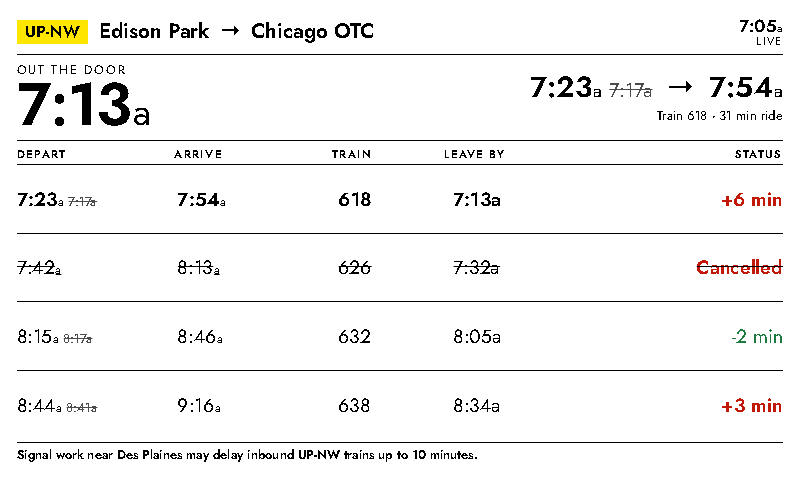

# Metra

A commuter departure board for any Metra trip: the next few trains between two
stations, how long the ride takes, and the time you need to be out the door to
catch the next one.



## Data sources

| Data | Source | API key |
|---|---|---|
| Schedules, stations, lines | [GTFS static feed](https://schedules.metrarail.com/gtfs/schedule.zip) | Not required |
| Delays, cancellations, alerts | [GTFS-Realtime feeds](https://metra.com/metra-gtfs-api) | Required |

The plugin is fully functional without an API key — it just shows scheduled
times. Adding a key upgrades the board with live data.

The static feed is downloaded once, compiled into a compact per-line index under
`.cache/`, and only re-downloaded when Metra publishes a new schedule (checked at
most every 6 hours via `published.txt`). Refreshes read from the cache, so they
are fast and cheap even on a Pi Zero.

## Settings

| Setting | Description |
|---|---|
| Line | Any of the 11 Metra lines |
| From / To | Stations on that line. Only trips that serve the origin *before* the destination are shown, so direction is inferred automatically. |
| Minutes to station | Your walk/drive time. Subtracted from the departure to produce the headline "out the door" time and the *Leave by* column. Set it to 0 and the headline becomes the departure time itself. |
| Trains to show | 3–8 upcoming departures |
| Use live delays | Applies realtime trip updates (needs `METRA_API_KEY`) |
| Show service alerts | Displays active alerts for the line (needs `METRA_API_KEY`) |

Status values: `Scheduled` (no realtime data yet), `On time`, `+N min`, `-N min`,
and `Cancelled`. When a train is delayed, the *Depart* column shows the predicted
time with the original struck through beside it. Cancelled trains are struck
through and skipped when picking the headline train.

All times are wall-clock rather than relative, so the board does not go stale
between refreshes.

## Optional: live delays

1. Agree to the license and submit the request form at
   [metra.com/developers](https://www.metra.com/developers). Approval takes about
   one business day.
2. Add the token to the device's `.env` (or use Settings → API Keys in the web UI):
   ```
   METRA_API_KEY=your-token
   ```
3. The header switches from `SCHEDULED` to `LIVE` once realtime data is applied.

## Guaranteeing a morning refresh

InkyPi's refresh loop wakes on the global **Plugin Cycle Interval** and then
round-robins through the active playlist, so a per-instance "daily at 07:15"
refresh is not guaranteed to fire at 07:15. Use a dedicated, short playlist
instead — the playlist with the *narrowest* active time window always wins, so
the board takes over the display for exactly the window you care about.

1. **Settings → Plugin Cycle Interval:** set to `5` minutes.
2. **Playlist → Add Playlist:** name it `Morning Commute`, start `06:45`, end `08:30`.
3. Open the Metra plugin, configure your trip, and **Add to Playlist** →
   `Morning Commute`, with Refresh set to **Every 5 minutes**.

Between 6:45 and 8:30 the display shows nothing but a continuously updating train
board; outside that window your normal playlist resumes. The display only
physically redraws when the rendered image actually changes, so the short cycle
interval does not cause constant e-ink refreshes.

## Local preview

```bash
python scripts/test_metra.py            # renders every panel size/orientation
```
